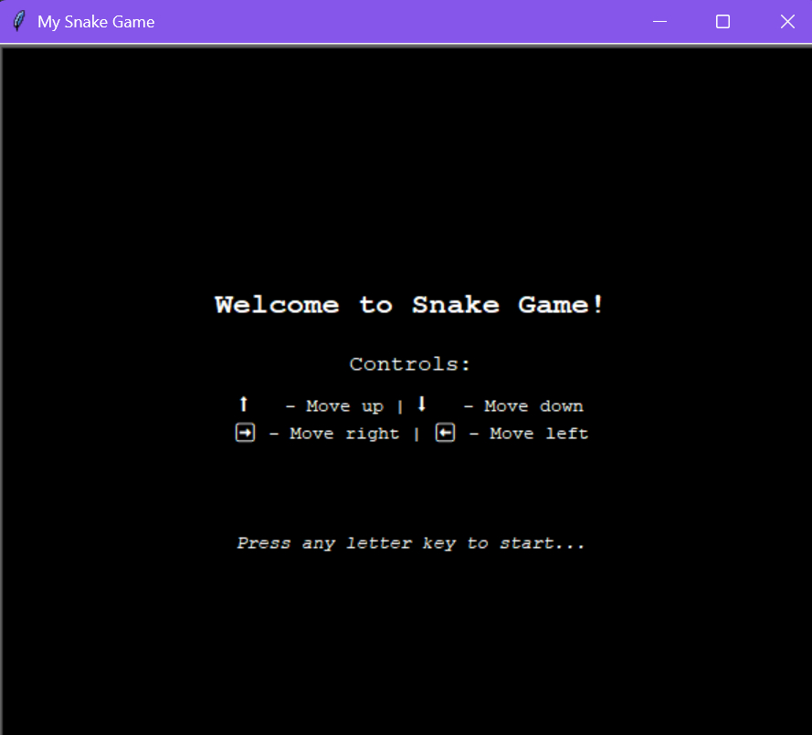
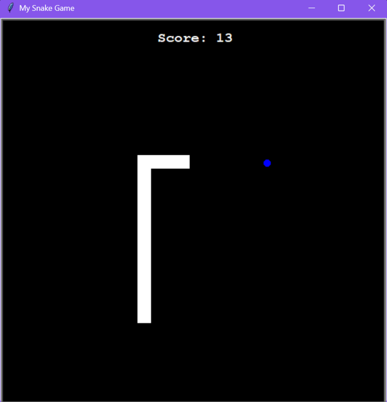
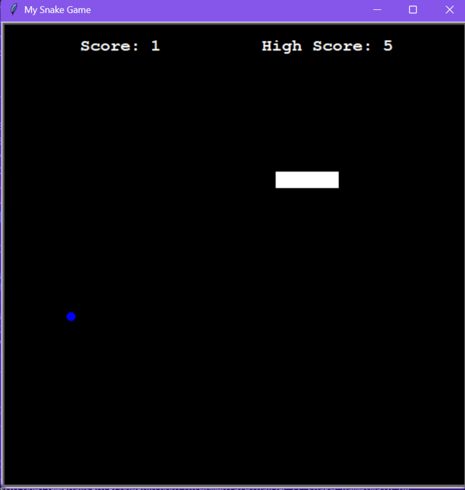
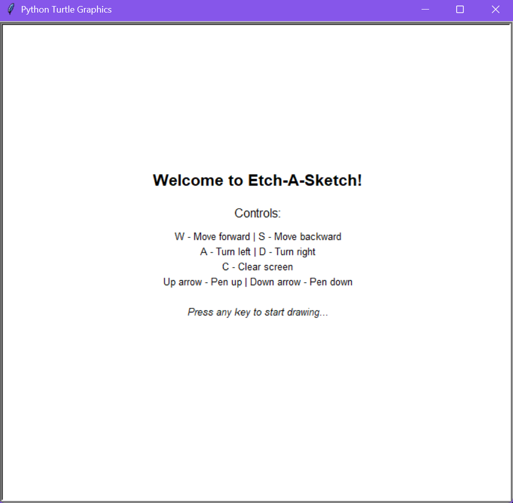
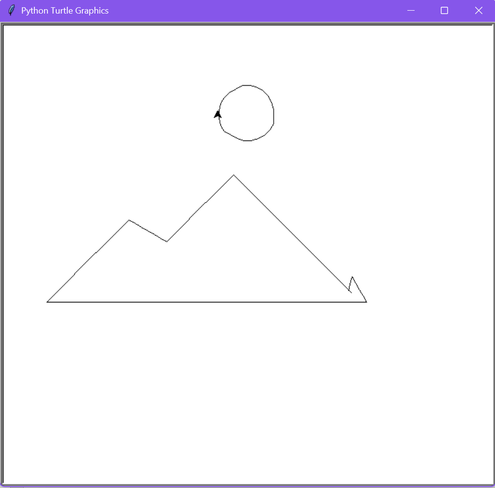
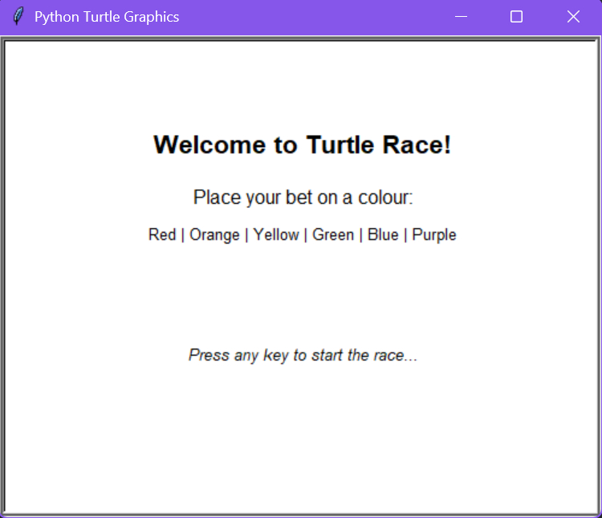
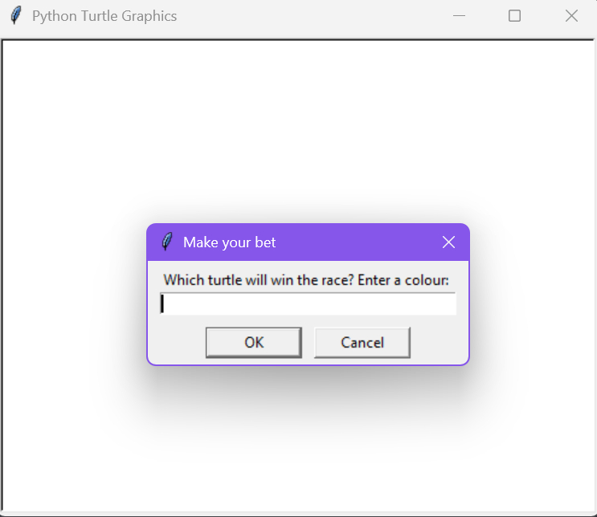
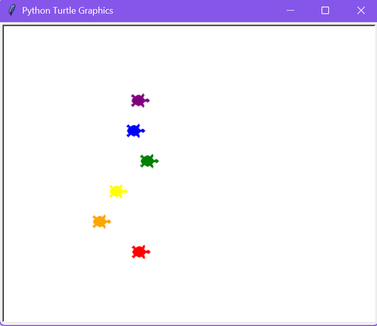
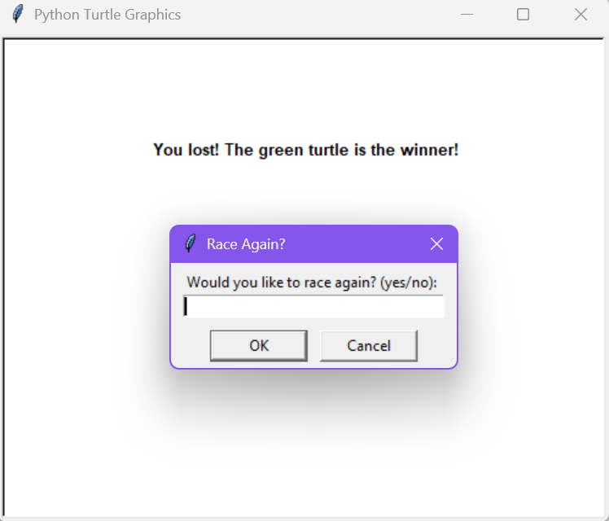
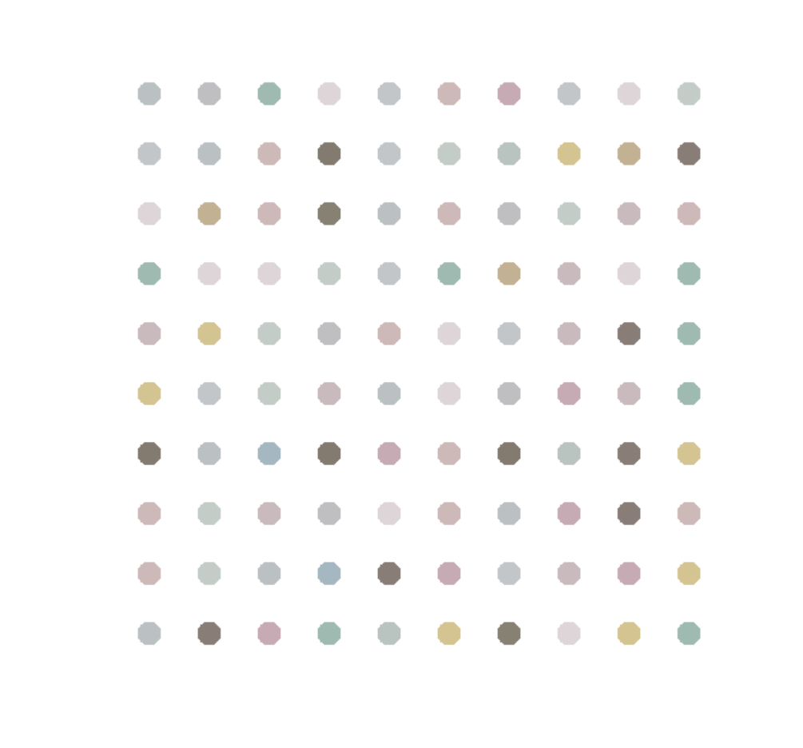

100 Days Of Code: The Complete Python Pro Bootcamp

These projects were created as part of [Dr. Angela Yu's "100 Days of Code: The Complete Python pro Bootcamp"](https://www.udemy.com/course/100-days-of-code) course on Udemy.

(Latest projects are added to the top of the list.)

## Table of Contents

- [Intermediate](#intermediate)
  - [Day 22 - Build Pong: The Famous Arcade Game](#day-22---build-pong-the-famous-arcade-game)
  - [Day 21 - Build the Snake Game Part 2: Inheritance & List Slicing](#day-21---build-the-snake-game-part-2-inheritance--list-slicing)
  - [Day 20 - Build the Snake Game Part 1: Animation & Coordinates](#day-20---build-the-snake-game-part-1-animation--coordinates)
  - [Day 19 - Instances, State and Higher Order Functions](#day-19---instances-state-and-higher-order-functions)
  - [Day 18 - Turtle & the Graphical User Interface (GUI)](#day-18---turtle--the-graphical-user-interface-gui)
  - [Day 17 - The Quiz Project & the Benefits of OOP](#day-17---the-quiz-project--the-benefits-of-oop)
  - [Day 16 - Object Oriented Programming (OOP)](#day-16---object-oriented-programming-oop)
  - [Day 15 - Local Development Environment Setup & the Coffee Machine](#day-15---local-development-environment-setup--the-coffee-machine)
- [Beginner](#beginner)
  - [Day 14 - Higher Lower Game Project](#day-14---higher-lower-game-project)
  - [Day 13 - Debugging: How to Find and Fix Errors in Your Code](#day-13---debugging-how-to-find-and-fix-errors-in-your-code)
  - [Day 12 - Scope & Number Guessing Game](#day-12---scope--number-guessing-game)
  - [Day 11 - The Blackjack Capstone Project](#day-11---the-blackjack-capstone-project)
  - [Day 10 - Functions with Outputs](#day-10---functions-with-outputs)
  - [Day 9 - Dictionaries, Nesting and the Secret Auction](#day-9---dictionaries-nesting-and-the-secret-auction)
  - [Day 8 - Function Parameters & Caesar Cipher](#day-8---function-parameters--caesar-cipher)
  - [Day 7 - Hangman](#day-7---hangman)
  - [Day 6 - Python Functions & Karel](#day-6---python-functions--karel)
  - [Day 5 - Python Loops](#day-5---python-loops)
  - [Day 4 - Randomisation and Python Lists](#day-4---randomisation-and-python-lists)
  - [Day 3 - Control Flow and Logical Operators](#day-3---control-flow-and-logical-operators)
  - [Day 2 - Understanding Data Types and How to Manipulate Strings](#day-2---understanding-data-types-and-how-to-manipulate-strings)
  - [Day 1 - Working with Variables in Python to Manage Data](#day-1---working-with-variables-in-python-to-manage-data)
- [Other](#other)
  - [Tools and Technologies Used](#tools-and-technologies-used)
  - [Author](#author)

# Intermediate

## Day 22 - Build Pong: The Famous Arcade Game

This project is part of the 100 Days of Code: Python course. Today’s goal is to recreate the classic Pong game using the Turtle graphics module. The project focuses on breaking the game down into manageable components using object-oriented programming.

### ✅ What I’ve Done So Far

- **Created the screen**
  - Set up an 800x600 black screen with `tracer(0)` for manual control of updates.
- **Created the paddle**
  - Built a `Paddle` class using inheritance from `Turtle`.
  - Used keyboard bindings to move the paddle up and down.
- **Created a second paddle**
  - Reused the `Paddle` class to instantiate a second paddle on the opposite side.
  - Mapped different key bindings (`w`/`s` for left paddle, `Up`/`Down` for right paddle).
- **Created the ball**
  - Built a `Ball` class using inheritance from `Turtle`.
  - Implemented basic directional movement using `forward()` and `setheading()`.
  - Added collision detection with the top and bottom walls, and bounce logic to reverse direction.

### 💡 Key Learnings

#### Using `tracer(0)` and `update()`:

Turning off automatic animation allows finer control over screen updates, which is especially useful when managing multiple moving elements.

```python
screen.tracer(0)
...
while True:
    screen.update()
```

#### Handling multiple key bindings:

Passing key bindings into a function avoids duplicated logic and keeps the code clean:

```python
def bind_keys(screen: Screen, paddle: Paddle, key_up: str, key_down: str) -> None:
    screen.listen()
    screen.onkeypress(key=key_up, fun=paddle.move_up)
    screen.onkeypress(key=key_down, fun=paddle.move_down)
```

#### Controlling movement using `setheading()` and `forward()`:

Instead of manually calculating `x` and `y` positions, using `setheading(angle)` and `forward(distance)` allows for more natural and flexible movement in any direction.

```python
self.setheading(45)
self.forward(10)
```

#### Encapsulating behaviour in class methods:

By keeping bounce logic `_wall_bounce()` inside the `Ball` class, the code stays modular and easier to maintain. It separates responsibilities clearly between objects in the game.

### 🔧 Next Steps

- Detect paddle collisions and deflections.
- Detect when a paddle misses the ball and track scores.
- Create a `Scoreboard` class to display and update the score.

### Code & Potential Improvements:

Solution URL:

- [Day 22 - Pong Game](./intermediate/day22_pong_game/main.py)

Other files:

- [Paddle Class](./intermediate/day22_pong_game/paddle.py)
- [Ball Class](./intermediate/day22_pong_game/ball.py)

## Day 21 - Build the Snake Game Part 2: Inheritance & List Slicing

This is the second stage in building the classic Snake game using Python and the Turtle graphics module.

Goals for Part 2:

- Detect when the snake eats the food.
- Update and display the score.
- Detect collision with the wall.
- Detect collision with the snake's own tail.

Updates and amendments have been made to the two previously created files.

- `main.py` - Added in collision detection with food (increases score and snake length), wall (triggers game over) and tail (triggers game over).
- `snake.py` - Added the `extend_snake()` method to allow growth when food is eaten.

Two further files were implemented.

- `food.py` - Contains the `Food` class responsible for randomly placing food on the screen, handles appearance and refresh logic after being eaten.
- `scoreboard.py` - Contains the `Scoreboard` class responsible for keeping track of the current score and displaying the score to the screen, plus showing a game over message.

### Code & Potential Improvements:

Solution URL:

- [Day 21 - Snake Game: Part 2](./intermediate/day20_21_snake_game/main.py)

Other files:

- [Snake Class](./intermediate/day20_21_snake_game/snake.py)
- [Food Class](./intermediate/day20_21_snake_game/food.py)
- [Scoreboard CLass](./intermediate/day20_21_snake_game/scoreboard.py)
- [Instructions Class](./intermediate/day20_21_snake_game/instructions.py)
- [High Score](./intermediate/day20_21_snake_game/high_score.txt)

Potential improvements include:

- Display instructions in graphics window (notifying user of keyboard commands) - ADDED.
  - The purpose of this was to improve the user experience by displaying clear controls and start instructions before the game begins.
  - Instruction display added - Game instructions (including arrow key controls and a start message) are shown in the graphical window before gameplay begins.
  - `instructions.py` - Contains the `Instructions` class which:
    - Display formatted text to the screen.
    - Waits for any keypress to start the game.
    - Clears instructions once a key is pressed and initiates the game loop.
  - Modified the `Scoreboard` class - The `_display_score()` method was renamed to `display_score()` and made public to allow the score to be manually redrawn after instructions are cleared and before the game starts.
  - Updated `main.py` to:
    - Integrate the `Instructions` class into the setup.
    - Added `start_game()` functions to clear instructions, bind movement keys, display the score and start the game loop.
    - Added `main()` to encapsulate all setup logic, and cleanly structure the program entry point.
      Changed `screen.exitonclick()` to `screen.mainloop()` for being able to keep the the Turtle graphics window open and responsive to events (e.g. kep pressing).
- Replay functionality - allow the user to restart the game - ADDED.
  - After the snake hits the wall or itself, the user is prompted with a dialog asking if they want to play again. If they enter `yes` or `y`, a new game begins. Otherwise, the Turtle window closes. Key changes made:
    - Replay Prompt: After the game ends, a `screen.textinput()` asks: "Do you want to play again? (yes/no)". If "yes" or "y", the game restarts.
    - Screen Reset: `screen.clear()` and screen properties are reset between games.
    - Looped Gameplay: `start_game()` now loops until user declines to play again.
    - Input Handling: Game only restarts if the input is exactly "yes" or "y" (case-insensitive).
- High score tracking - store and display the highest score- ADDED.
  - Added a persistent high score functionality using a `high_score.txt` file/
  - `Scoreboard` now displays the current high score alongside the current score.
  - High score updates automatically if the player beats the high score.
  - `Scoreboard` class updated to:
    - Load the high score from file (high_score.txt) on initialisation.
    - Save a new high score when the game ends.
    - High score file is created if it doesn't exist, with a default of 0.
- Difficulty levels - allow the user to choose a difficulty level (possibly related to speed of snake).

 


## Day 20 - Build the Snake Game Part 1: Animation & Coordinates

This is the first stage in building the classic Snake game using Python and the Turtle graphics module.

Goals for Part 1:

- Create the snake body with individual segments.
- Animate the snake by moving its segments smoothly.
- Control the snake's direction using the arrow keys.

Two files are currently implemented.

- `main.py` - Sets up the game screen, binds key controls, and runs the main game loop.
- `snake.py` - Contains the `Snake` class responsible for creating the snake, moving it, and handling directional control.

### Code:

Key features implemented:

- Smooth movement - each segment follows the one ahead for fluid motion.
- Directional logic - the snake cannot instantly reverse direction (e.g. from up to down).
- Manual screen updates - use of `tracer(0)` and `update()` gives full control over rendering.
- Enhanced code clarity by introducing type annotations and comprehensive docstrings.
- Refactored both `main.py` and `snake.py`.

Solution URL:

- [Day 20 - Snake Game: Part 1](./intermediate/day20_21_snake_game/)

The state of the code as of the end of part 1:

main.py

```python
from turtle import Screen
from snake import Snake
import time


#---------- CONSTANTS ----------#

SCREEN_WIDTH: int = 600
SCREEN_HEIGHT: int = 600
SNAKE_SPEED: float = 0.1 # Time delay in seconds


#---------- SETUP DISPLAY AND CONTROLS ----------#

def create_screen() -> Screen:
    """Initialise and return the main game screen."""
    screen = Screen()
    screen.setup(width=SCREEN_WIDTH, height=SCREEN_HEIGHT)
    screen.bgcolor("black")
    screen.title("My Snake Game")
    screen.tracer(0) # Turns off automatic screen updates
    return screen


def bind_keys(screen:Screen, snake:Snake) -> None:
    """Bind keyboard keys to snake movement functions"""
    screen.listen()
    screen.onkeypress(key="Up", fun=snake.up)
    screen.onkeypress(key="Down", fun=snake.down)
    screen.onkeypress(key="Left", fun=snake.left)
    screen.onkeypress(key="Right", fun=snake.right)


#---------- MAIN PROGRAM ----------#

def main() -> None:
    """Run the main loop for the snake game."""
    screen = create_screen()
    snake = Snake()
    bind_keys(screen, snake)

    game_is_on = True
    while game_is_on:
        screen.update()
        time.sleep(SNAKE_SPEED) # Adds a delay to make the snake's movement appear smooth and cohesive
        snake.move_snake()

    screen.exitonclick()


# ---------- ENTRY POINT ---------- #

if __name__ == "__main__":
    main()

```

snake.py

```python
from turtle import Turtle

class Snake:
    """Represents the snake in a classic Snake game. Manages creation, movement and directional control of the snake segments."""

    #---------- CONSTANTS ----------#

    SNAKE_COLOUR: str = "white"
    SNAKE_SHAPE: str = "square"
    STARTING_POSITIONS: list[tuple[int, int]] = [(0, 0), (-20, 0), (-40, 0)]
    MOVE_DISTANCE: int = 20 # Distance each segment moves per step (size of each Turtle segment)
    UP: int = 90
    DOWN: int = 270
    LEFT: int = 180
    RIGHT: int = 0


    #---------- INTERNAL METHODS ----------#

    def __init__(self) -> None:
        self.snake: list[Turtle] = self._create_snake()
        self.head: Turtle = self.snake[0]


    def _create_snake(self) -> list[Turtle]:
        """Create snake segments at the starting positions and store them in a list."""
        snake: list[Turtle] = []
        for x, y in self.STARTING_POSITIONS:
            segment = Turtle(shape=self.SNAKE_SHAPE)
            segment.color(self.SNAKE_COLOUR)
            segment.penup()
            segment.goto(x=x, y=y)
            snake.append(segment)
        return snake


    #---------- EXTERNAL METHODS ----------#

    def move_snake(self) -> None:
        """Move each segment to the position of the segment in front, then move the head forward."""
        for i in range(len(self.snake) - 1, 0, -1):
            new_x = self.snake[i - 1].xcor()
            new_y = self.snake[i - 1].ycor()
            self.snake[i].goto(x=new_x, y=new_y)
        self.head.forward(self.MOVE_DISTANCE)


    def up(self) -> None:
        """Change direction to up unless currently moving down."""
        if self.head.heading() != self.DOWN:
            self.head.setheading(self.UP)


    def down(self) -> None:
        """Change direction to down unless currently moving up."""
        if self.head.heading() != self.UP:
            self.head.setheading(self.DOWN)


    def left(self) -> None:
        """Change direction to left unless currently moving right."""
        if self.head.heading() != self.RIGHT:
            self.head.setheading(self.LEFT)


    def right(self) -> None:
        """Change direction to right unless currently moving left."""
        if self.head.heading() != self.LEFT:
            self.head.setheading(self.RIGHT)
```

## Day 19 - Instances, State and Higher Order Functions

### Etch-A-Sketch

This project focused on creating an interactive Etch-A-Sketch style drawing application using Python’s [Turtle](https://pypi.org/project/PythonTurtle/) module. The Etch-A-Sketch program allows the user to control a turtle cursor to draw lines by using keyboard controls to move forward, backward, and turn left or right. The program also includes features such as:

- Clear screen functionality to reset the drawing.
- Use of constants to manage movement distance and turning angle.
- Boundary detection to prevent the turtle from moving off-screen.

### Code & Potential Improvements:

Solution URL:

- [Day 19 - Etch-A-Sketch](./intermediate/day19_etch_a_sketch.py)

Potential improvements include:

- Display instructions in graphics window (notifying user of keyboard commands) - ADDED.
- Allow for pen to be lifted up/down so can move cursor to a different location before drawing again - ADDED.
- Adding speed control to let users change the turtle’s movement speed.
- Implementing colour changing via keyboard commands to create more dynamic drawings.
- Adding undo/redo features to manage drawing history.

 

### Turtle Race

This project focused on creating a fun and interactive turtle racing game using Python's [Turtle](https://pypi.org/project/PythonTurtle/) graphics module. The program prompts the user to place a bet on which coloured turtle they think will win the race. Once the bet is placed, multiple turtles race from left to right across the screen, each moving forward by a random amount on each iteration. The race ends when one of the turtles crosses the finish line, and a message displays whether the user won or lost their bet.

### Code & Potential Improvements:

Solution URL:

- [Day 19 - Turtle Race](./intermediate/day19_turtle_race.py)

Potential improvements include:

- Display instructions in graphics window (notifying user of colours can bet on) - ADDED.
- Display input error message and race result in graphics window - ADDED.
- Add replay option - ADDED.
- Add a score function for how many bets won.

 
 

## Day 18 - Turtle & the Graphical User Interface (GUI)

This session involved a serious of mini-projects exploring Python's built-in `Turtle` module to generate various shapes and visual patterns, along with randomised colour-based artwork. The focus was on learning how to use turtle graphics for creative drawing, integrating colour, and controlling movement on screen.

The [Turtle](https://pypi.org/project/PythonTurtle/) module was used to the following graphical outputs:

- A square
- A dashed line
- Multiple polygon shapes with randomised colours
- A random walk (random path with randomised colours)
- A spirograph with randomised colours

These projects utilised direction control, pen manipulation and colour randomisation to create dynamic visual effects.

### Dot Painting

The [Colorgram](https://pypi.org/project/colorgram.py/) module was used to extract colour palettes from an image. These RGB colour tuples were then used along with the turtle module to create a grid of coloured dots in the style of Damien Hirst's iconic spot paintings.

```python
colours = colorgram.extract("image.jpg", 30)
rgb_colours = [(colour.rgb.r, colour.rgb.g, colour.rgb.b) for colour in colours] # need colours in rgb format
```

These colours were manually saved to a list and used to randomly assign colours to each dot in a 10 x 10 grid, with consistent spacing and size.

Here's the result of my dot painting creation:



### Code & Potential Improvements:

Solution URLs:

- [Day 18 - Turtle Drawings](./intermediate/day18_turtle_drawings.py)
- [Day 18 - Hirst Painting](./intermediate/day18_hirst_painting.py)

`screen.exitonclick()` was used to keep the turtle window open until clicked upon by the user.

## Day 17 - The Quiz Project & the Benefits of OOP

This is a True/False quiz game project developed using Object Oriented Programming (OOP) principles to ensure clarity and modularity.

Class Responsibilities:

`Question`: Represents a single quiz question along with its correct answer.

`QuizBrain`: Manages the core quiz logic, including:

- Quiz progression (`question_number`).
- Scoring tracking (`score`).
- Handling the list of questions (`question_list`).
- Managing user input and responses.

### Code & Potential Improvements:

Solution URL: [Day 17 - Quiz Game](./intermediate/day17_quiz_game/main.py)

Data file: [Data](./intermediate/day17_quiz_game/data.py)

OOP files:

- [Question Class](./intermediate/day17_quiz_game/question_model.py)
- [QuizBrain Class](./intermediate/day17_quiz_game/quiz_brain.py)

Key enhancements made:

- Input validation: I added robust input handling to ensure only `True` or `False` responses are accepted.
- Encapsulation: I made `check_answer()` and `get_choice()` private methods, as they are only used within the `QuizBrain` class.
- Refactoring:
  - I renamed some variables and methods for improved readability and clarity.
  - I added type annotations to method parameters and return types for better code understanding.

## Day 16 - Object Oriented Programming (OOP)

This project is a refactor of the [Day 15 coffee machine](#day-15---local-development-environment-setup--the-coffee-machine) exercise, redesigning the program using Object Oriented Programming principles. The classes (`CoffeeMaker`, `Menu` and `MoneyMachine`) were provided as part of the project, and the main task was to rewrite the coffee machine’s functionality by properly implementing and leveraging these classes and their methods.

### Code & Potential Improvements:

Solution URL: [Day 16 - OOP Coffee Machine](./intermediate/day16_oop_coffee_machine/main.py)

OOP files:

- [CoffeeMaker Class](./intermediate/day16_oop_coffee_machine/coffee_maker.py)
- [Menu Class](./intermediate/day16_oop_coffee_machine/menu.py)
- [MoneyMachine Class](./intermediate/day16_oop_coffee_machine/money_machine.py)

Documentation:

- [Coffee Machine Classes Documentation (PDF)](./intermediate/day16_oop_coffee_machine/Coffee+Machine+Classes+Documentation.pdf)

In adapting the coffee machine to utilise OOP:

- Valid drinks are dynamically generated and sorted from the `Menu` class, ensuring input validation stays accurate without manual updates.
- While the classes provide convenient methods such as `money.report()` and `menu.get_items()`, I chose to comment those out to preserve the exact output format from my original procedural version. Instead, I extracted and formatted data directly from the class attributes, thereby retaining consistent output while still utilising the class-based design.
- Resource refilling directly updates the `CoffeeMaker`’s resources with validated whole numbers.
- Drink lookup utilises `Menu.find_drink()` for cleaner and more readable code.

## Day 15 - Local Development Environment Setup & the Coffee Machine

This project simulates the operation of a simple coffee machine via a command-line interface. It covers user input handling, resource management, payment processing, and transaction validation, allowing users to purchase drinks and operators to manage the machine's status.

Coffee Machine Program Requirements:

1. Prompt user by asking “What would you like? (espresso/latte/cappuccino):”

- Check the user’s input to decide what to do next.
- The prompt should show every time action has completed, e.g. once the drink is dispensed. The prompt should show again to serve the next customer.

2. Turn off the Coffee Machine by entering “off” to the prompt.

- For maintainers of the coffee machine, they can use “off” as the secret word to turn off the machine. The code should end execution when this happens.

3. Print report.

- When the user enters “report” to the prompt, a report should be generated that shows the current resource values. e.g.

  ```
  Water: 100ml
  Milk: 50ml
  Coffee: 76g
  Money: $2.50
  ```

4. Check resources sufficient?

- When the user chooses a drink, the program should check if there are enough resources to make that drink.
- E.g. if Latte requires 200ml water but there is only 100ml left in the machine. It should not continue to make the drink but print: “Sorry there is not enough water.”
- The same should happen if another resource is depleted, e.g. milk or coffee.

5. Process coins.

- If there are sufficient resources to make the drink selected, then the program should prompt the user to insert coins.
- Remember that quarters = $0.25, dimes = $0.10, nickles = $0.05, pennies = $0.01
- Calculate the monetary value of the coins inserted. E.g. 1 quarter, 2 dimes, 1 nickel, 2 pennies = 0.25 + 0.1 x 2 + 0.05 + 0.01 x 2 = $0.52

6. Check transaction successful?

- Check that the user has inserted enough money to purchase the drink they selected.
- E.g Latte cost $2.50, but they only inserted $0.52 then after counting the coins the program should say “Sorry that's not enough money. Money refunded.”.
- But if the user has inserted enough money, then the cost of the drink gets added to the machine as the profit and this will be reflected the next time “report” is triggered. E.g.
  ```
  Water: 100ml
  Milk: 50ml
  Coffee: 76g
  Money: $2.50
  ```
- If the user has inserted too much money, the machine should offer change.
- E.g. “Here is $2.45 dollars in change.” The change should be rounded to 2 decimal places.

7. Make Coffee.

- If the transaction is successful and there are enough resources to make the drink the user selected, then the ingredients to make the drink should be deducted from the coffee machine resources.
- E.g. report before purchasing latte:
  ```
  Water: 300ml
  Milk: 200ml
  Coffee: 100g
  Money: $0.0
  ```
- Report after purchasing latte:
  ```
  Water: 100ml
  Milk: 50ml
  Coffee: 76g
  Money: $2.50
  ```
- Once all resources have been deducted, tell the user “Here is your latte. Enjoy!”. If latte was their choice of drink.

### Code & Potential Improvements:

Solution URL: [Day 15 - Coffee Machine](./intermediate/day15_coffee_machine.py)

1. Initialisation:

- Defines the starting resources (water, milk, coffee) and sets `profit = 0.0`.

2. Input Handling:

- `get_choice(prompt)`: Validates user input for drink options and commands.
- `get_number(prompt)`: Safely collects numeric inputs for coin values.

3. Coffee Machine Functions:

- `print_report()`: Displays current resources and total money earned.
- `is_resource_sufficient(ingredients)`: Ensures the machine has enough resources for a selected drink.
- `collect_payment()`: Prompts for coins and calculates the total amount inserted.
- `process_transaction(payment, cost)`: Validates payment, updates profit, and issues change if needed.
- `make_coffee(drink_name, ingredients)`: Deducts used ingredients and confirms drink delivery.

4. Coffee Machine Loop:

- Runs continuously until `off` is entered.
- Handles the `report` command before processing drinks orders.

5. Potential Improvements:

- Refill resources: Add a feature to allow topping up of ingredients during runtime.
  - Added `refill_resources()` and modified `get_number(prompt)` to get 0 and positive numbers only.
- Menu display: Show available drinks and prices.
  - Added `print_menu()`
- Have data persist after turned `off` so can keep amount of resources and profit (save to a file).

# Beginner

## Day 14 - Higher Lower Game Project

Build a Higher Lower Game where the player must guess which of two options has the higher follower count.

Game Features:

- Score points for every correct guess.
- Randomly choose two different items to compare (must not be the same item).
- When the player guesses correctly, move option B to option A and randomly generate a new option B.
- When the player guesses incorrectly, the game ends.

### Code & Potential Improvements:

I created the following flowchart to outline the game's logic and flow:


Solution URL: [Day 14 - Higher Lower Game](./beginner/day14_higher_lower.py)

Input Handling:

- Added a reusable input validation function: `get_choice()`
  - Ensures input is `A` or `B` (used for player guesses), or `Y` or `N` (used to replay the game)

Data Handling functions:

- `get_random_item()` - retrieves a random item from [higher_lower_data.py](./beginner/higher_lower_data.py)
- `get_comparison_item(item)` - ensures the second item is different from the first.
- `format_item_info()` - formats for display item information clearly to the user.
- `compare_follower_accounts(item_a, item_b)` - compares follower counts and returns the correct choice (`A` or `B`).

Game logic:

- `play_game()` - runs each game session, handles comparison logic and tracks scoring.
- `start_higher_lower()` - manages replay functionality.

## Day 13 - Debugging: How to Find and Fix Errors in Your Code

Day 13 focused on various debugging techniques and how to use a debugger tool.

## Day 12 - Scope & Number Guessing Game

Build a Number Guessing Game where the player must guess a randomly chosen number between 1 and 100.

Game Features:

- Two difficulty levels:
  - Easy level - 10 attempts to guess number.
  - Hard level - 5 attempts to guess number.
- After each incorrect guess (if attempts remain), the player is told whether their guess was too high or too low.

### Code & Potential Improvements:

Before writing the code, I created the following flowchart to outline the game's logic and flow:


Solution URL: [Day 12 - Number Guessing Game](./beginner/day12_guess_the_number.py)

- Added input validation functions.
  - `get_level()` - ensures input is `easy` or `hard`
  - `get_number()` - ensures input is a number between 1 and 100
  - `get_y_n()` - ensures input is `y` or `n`
- Added play again functionality.
- Game logic separated into different functions for readability and modularity:
  - `get_attempts_by_level()` - sets attempts based on chosen level.
  - `player_guesses(attempts, target)` - handles guess checking and feedback to the player.
  - `start_game()` - initialises each game round.
  - `play_guess_number()` - handles play again logic.
- A potential improvement would be to add a scoring system that tracks wins/losses or records fewest guesses used to win (high score).

## Day 11 - The Blackjack Capstone Project

### Blackjack Game House Rules

Build a Blackjack game with the following rules:

- The deck is unlimited in size.
- There are no jokers.
- The Jack/Queen/King all count as 10.
- The Ace can count as 11 or 1.
- Use the following list as the deck of cards:
  `cards = [11, 2, 3, 4, 5, 6, 7, 8, 9, 10, 10, 10, 10]`
- The cards in the list have equal probability of being drawn.
- Cards are not removed from the deck as they are drawn.
- The computer is the dealer.

### Code & Potential Improvements:

I created this flowchart to visualise the game logic before coding:


Solution URL: [Day 11 - Blackjack](./beginner/day11_blackjack.py)

- Added input handling:
  - `get_choice(prompt)` - ensures input is `y` or `n`
- Broke the game into dedicated functions for each task:
  - `change_ace_score(hand)`
  - `show_final_cards(player, dealer)`
  - `bust(hand, player, dealer)`
  - `player_turn(player, dealer)`
  - `dealer_turn(dealer)`
  - `compare_scores(player_score, dealer_score)`
  - `start_game()`
  - `play_blackjack()`
- Refactored for clarity and maintainability:
  - Renamed variables and functions for clearer meaning e.g. `cards` -> `card_values`.
  - Reduced function parameters by calculating `player_score` and `dealer_score` inside the relevant functions.
  - Extracted specific tasks into smaller, purpose-specific functions:
    - `deal_initial_cards()` - handles card dealing.
    - `check_blackjack(player, dealer)` checks if either player or dealer hits blackjack.
  - Added a reusable helper function for detecting blackjack:
    ```python
    def has_blackjack(hand):
      return sum(hand) == 21 and len(hand) == 2
    ```
  - Ensured `player_turn()` and `dealer_turn()` both return `(score, is_bust)` to maintain consistency.
  - Moved blackjack checks out of `compare_scores()` and into `check_blackjack()`.
  - Simplified `start_game()` so the sequence of gameplay is easier to follow: deal cards, check for blackjack, player's turn, dealer's turn, check for busts, compare scores.

## Day 10 - Functions with Outputs

Build a calculator program:

- Use functions to to calculate add, subtract, multiply and divide.
- Have a dictionary store keys for +, -, \*, / and values as the corresponding functions.
- Use the dictionary to perform the calculations.
- Program asks the user to type the first number.
- Program asks the user to type a mathematical operator (a choice of `+`, `-`, `*` or `/`)
- Program asks the user to type the second number.
- Program works out the result based on the chosen mathematical operator.
- Program asks if the user wants to continue working with the previous result.
- If yes, program loops to use the previous result as the first number and then repeats the calculation process.
- If no, program asks the user for the fist number again and wipes all memory of previous calculations.
- Add the logo from `calculator_art.py`.

### Code & Potential Improvements:

Solution URL: [Day 10 - Calculator](./beginner/day10_calculator.py)

- Added input checking:
  - `get_number()` uses `while True`, along with `try / except ValueError` to ensure only numbers have been entered.
  - `get_operation()` uses `while True` to ensure only valid calculator operators have been entered.
  - `get_continue_choice()` uses `while True`to ensure either `y` or `n` has been entered.

## Day 9 - Dictionaries, Nesting and the Secret Auction

Build a blind auction program:

- Use the flowchart to guide the creation of the blind auction program:
  
- Ask the user for input: name and bid.
- Save the data into a dictionary.
- Check whether new bids need to be entered.
- Compare the bids in the dictionary.

### Code & Potential Improvements:

Solution URL: [Day 9 - Secret Auction](./beginner/day9_secret_auction.py)

- Used `while True`, along with `try / except ValueError` to check the input for the bids are valid numbers.
- If there are other bids, `print("\n" * 20)` was used to create some vertical space for the next bidder to not see the previous bid on the screen.
- Formatted the output of the winning bid to 2dp to keep it consistent with how currency is written: `${max_bid:.2f}`.

## Day 8 - Function Parameters & Caesar Cipher

### Project requirements

- Create a function called `encrypt()` that takes `original_text` and `shift_amount` as two inputs.
  - The function should shift each letter of the `original_text` forwards in the alphabet by the `shift_amount` and print the encrypted text.
- Call the `encrypt()` function and pass in the user inputs. Test the code and encrypt a message.
- Fix the code so that it wraps around to the start of the alphabet if the letter is shifted past z.

- Create a function called `decrypt()` that takes `original_text` and `shift_amount` as inputs.
  - The function should shift each letter of the `original_text` **backwards** in the alphabet by the `shift_amount` and print the decrypted text.

As the `encrypt()` and `decrypt()` functions are so similar:

- Combine them into one function called `caesar()`.
  - Use the value of the user chosen `direction` variable to determine which functionality to use.
- Call the caesar function instead of `encrypt()`/`decrypt()` and pass in all three variables `direction`/`text`/`shift`.

- Import and print the logo from `caesar_art.py` when the program starts.
- Deal with if the user enters a number/symbol/space.
- Add the ability to restart the cipher program again

### Code & Potential Improvements:

Solution URL: [Day 8 - Caesar Cipher](./beginner/day8_caesar_cipher.py)

- When calling `caesar()` I ensured it was very clear what variables belonged to which parameters by using named arguments: `caesar(original_text=text, shift_amount=shift, encode_or_decode=direction)`. This makes the function call more readable and avoids confusion, especially when a function has multiple parameters.

## Day 7 - Hangman

### Project requirements

- Create a flowchart showing how the hangman game works.
- Build a Hangman game:
  - Print the logo from `hangman_art.py`.
  - Randomly choose a word from the `word_list` (from `hangman_words.py`) and assign it to a variable called `chosen_word`.
  - Ask the user to guess a letter and assign their answer to a variable called `guess`.
  - Check if the letter the user guessed is one of the letters in the `chosen_word`.
  - Create an empty string called `placeholder`.
    - For each letter in the `chosen_word`, add a \_ to placeholder so each \_ represents a letter to guess.
  - Create an empty string called "display".
    - Loop through each letter in the `chosen_word`. If the letter at that position matches `guess` then reveal that letter in the display at that position.
  - Use a while loop to let the user guess again.
    - The loop should only stop once the user has guessed all the letters in the `chosen_word` and no \_ are left.
    - The for loop is to be updated so that previous guesses are added to the `display` string and the previous correct letters will also be printed out.
    - Tell the user they've won.
  - Create a variable called `lives` to keep track of the number of lives left - initialise with 6 lives.
  - If `guess` is not a letter in the chosen_word, then reduce `lives` by 1.
    - If `lives` goes down to 0 then the game should end, and it should tell the user they've lost.
  - If the user has entered a letter they've already guessed, print the letter and let them know. The user does not lose a life in this case.
  - Print the ASCII art from the list `stages` (from `hangman_words.py`) that corresponds to the current number of `lives` the user has remaining.
  - If the letter is not in the `chosen_word`, print out the letter and let the user know it's not in the word.
  - Tell the user how many `lives` they have left.
  - Tell the user the correct word they were trying to guess.

### Code & Potential Improvements:

Flowchart to show the logic of the Hangman game:


Solution URL: [Day 7 - Hangman](./beginner/day7_hangman.py)

- Incorrect guesses that have already been previously guessed do not lose another life. This is done by adding all incorrect guesses to `incorrect_letters` and checking guesses against `incorrect_letters` to see whether the user loses a life or not.
- Refactored to make more concise and improve readability.
- Added a check on user input to make sure a single letter was entered.
- Updated the flowchart to match changes made to the program. [Click here for the original flowchart](./beginner/hangman_flowchart.jpg).

## Day 6 - Python Functions & Karel

### Project requirements

[Reeborg](https://reeborg.ca/reeborg.html?lang=en&mode=python&menu=worlds%2Fmenus%2Freeborg_intro_en.json&name=Maze&url=worlds%2Ftutorial_en%2Fmaze1.json) was exploring a dark maze and the battery in its flashlight ran out.

Write a program using an if/elif/else statement so Reeborg can find the exit. The secret is to have Reeborg follow along the right edge of the maze, turning right if it can, going straight ahead if it can’t turn right, or turning left as a last resort.

### Code & Potential Improvements:

Solution URL: [Day 6 - Escaping The Maze](./beginner/day6_escaping_the_maze.txt)

- As there was no `turn_right()` function, I defined one, using the `turn_left()` function.
- Used the functions `at_goal()`, `right_is_clear()` and `front_is_clear()` to detect where it is possible for Reeborg to move to.

## Day 5 - Python Loops

### Project requirements

The program will ask:

- How many letters would you like in your password?
- How many numbers would you like?
- How many symbols would you like?

The objective is to take the inputs from the user to these questions and then generate a random password, with the letters, numbers and symbols mixed up in the password.

### Code & Potential Improvements:

Solution URL: [Day 5 - Password Generator](./beginner/day5_password_generator.py)

- I defined a function `get_input_quantity(password_question)` to obtain the answers to the questions posed to the user. This function uses `while True`, along with `try / except ValueError` to check the inputs to the user questions are valid numbers.
- I defined a function `generate_password_section(quantity, password_section, password)` to obtain the appropriate amount of letters, numbers and symbols as requested by the user. Using `random.choice(password_section)` to randomly pick an item from the appropriate list.
- Once the password is generated,`random.shuffle()` is used to mix up the letters, numbers and symbols in the password.

## Day 4 - Randomisation and Python Lists

### Project requirements

Build a Rock Paper Scissors game.

### Code & Potential Improvements:

Solution URL: [Day 4 - Rock Paper Scissors](./beginner/day4_rock_paper_scissors.py)

- I used a list to hold the ascii art variables to allow selection of rock, paper, scissors choices.
- I used `while True`, along with `try / except ValueError` and `if user_choice not in [0, 1, 2]` to check whether the user's choice was 0 (rock), 1 (paper), 2 (scissors).
- `import random` with `computer_choice = random.randint(0,2)` was used to generate a random choice for the computer.
- I used `if / elif` statements to compare the user and computer's choices to see who won the game.

## Day 3 - Control Flow and Logical Operators

### Project requirements:

Build a "Chose your own adventure game".

- Use the [flow chart](https://app.diagrams.net/?lightbox=1&highlight=0000ff&edit=_blank&layers=1&nav=1&title=Treasure%20Island%20Conditional.drawio#Uhttps%3A%2F%2Fdrive.google.com%2Fuc%3Fid%3D1oDe4ehjWZipYRsVfeAx2HyB7LCQ8_Fvi%26export%3Ddownload#%7B%22pageId%22%3A%22C5RBs43oDa-KdzZeNtuy%22%7D) linked to create the game logic for the adventure game.

  

### Code & Potential Improvements:

Solution URL: [Day 3 - Treasure Island](./beginner/day3_treasure_island.py)

- I used `if / else` statements to select the user's choice.
- I used a dictionary to hold the ending outcomes of which door the user selected at the end of the adventure game.

## Day 2 - Understanding Data Types and How to Manipulate Strings

### Project requirements:

1. To match how [https://appbrewery.github.io/python-day2-demo/](https://appbrewery.github.io/python-day2-demo/) operates.
2. Ask the user for the total bill amount.
3. Ask the user the tip percentage, choice of 10, 12 or 15%.
4. Ask the user how many people are splitting the bill.
5. Show the amount each person needs to pay, make sure answer is to 2 decimal places.

Example:

- If the bill was $150.00, split between 5 people, with 12% tip.
- Each person should pay: `(150.00 / 5) * 1.12 = 33.6`.
- After formatting the result to 2 decimal places = 33.60

### Code & Potential Improvements:

Solution URL: [Day 2 - Tip Calculator](./beginner/day2_tip_calculator.py)

- I used `while True` and `if` statements to check whether the bill and the number of people splitting the bill are numbers > 0 and if not to request the input again from the user.
- I used `while True` and `if tip not in [10, 12, 15]` to check whether the tip amount was 10, 12 or 15%.
- To get the output to always be to 2 decimal places:
  ```python
  print(f"Each person should pay: ${payment_per_person:.2f}")
  ```

## Day 1 - Working with Variables in Python to Manage Data

### Project requirements:

1. Create a greeting for your program.
2. Ask the user for the city that they grew up in and store it in a variable.
3. Ask the user for the name of a pet and store it in a variable.
4. Combine the name of their city and pet and show them their band name.
5. Make sure the input cursor shows on a new line.

### Code & Potential Improvements:

Solution URL: [Day 1 - Band Name Generator](./beginner/day1_band_name_generator.py)

- I used `while True` and `if` statements to check whether an empty string had been entered for the city and pet names and if so to request the input again from the user.

# Other

## Tools and Technologies Used

- Debugger
- Flowcharts
- Python
- PyCharm

## Author

- V. Tickner
