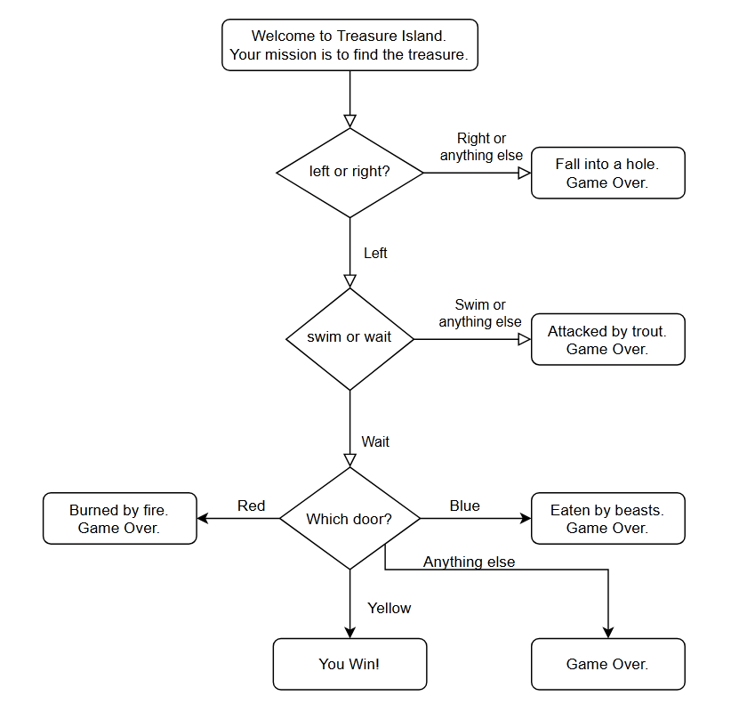

# 100 Days Of Code: The Complete Python Pro Bootcamp

These projects were created as part of [Dr. Angela Yu's "100 Days of Code: The Complete Python pro Bootcamp"](https://www.udemy.com/course/100-days-of-code) course on Udemy.

(Latest projects are added to the top of the list.)

## Table of Contents

- [Beginner](#beginner)
  - [Day 2 - Understanding Data Types and How to Manipulate Strings](#day-2---understanding-data-types-and-how-to-manipulate-strings)
  - [Day 1 - Working with Variables in Python to Manage Data](#day-1---working-with-variables-in-python-to-manage-data)
- [Other](#other)
  - [Tools and Technologies Used](#tools-and-technologies-used)
  - [Author](#author)

# Beginner

## Day 3 - Control Flow and Logical Operators

### Project requirements:

- Build a "Chose your own adventure game".
- Use the [flow chart](https://app.diagrams.net/?lightbox=1&highlight=0000ff&edit=_blank&layers=1&nav=1&title=Treasure%20Island%20Conditional.drawio#Uhttps%3A%2F%2Fdrive.google.com%2Fuc%3Fid%3D1oDe4ehjWZipYRsVfeAx2HyB7LCQ8_Fvi%26export%3Ddownload#%7B%22pageId%22%3A%22C5RBs43oDa-KdzZeNtuy%22%7D) linked to create the game logic for the adventure game.

  

### Code & Potential Improvements:

- Solution URL: [Day 3 - Treasure Island](./beginner/day3_treasure_island.py)
- I used `if / else` statements to select the user's choice.
- I used a dictionary to hold the ending outcomes of which door the user selected at the end of the adventure game.

## Day 2 - Understanding Data Types and How to Manipulate Strings

### Project requirements:

1. To match how [https://appbrewery.github.io/python-day2-demo/](https://appbrewery.github.io/python-day2-demo/) operates.
2. Ask the user for the total bill amount.
3. Ask the user the tip percentage, choice of 10, 12 or 15%.
4. Ask the user how many people are splitting the bill.
5. Show the amount each person needs to pay, make sure answer is to 2 decimal places.

Example:

- If the bill was $150.00, split between 5 people, with 12% tip.
- Each person should pay: `(150.00 / 5) * 1.12 = 33.6`.
- After formatting the result to 2 decimal places = 33.60

### Code & Potential Improvements:

- Solution URL: [Day 2 - Tip Calculator](./beginner/day2_tip_calculator.py)
- I used `while True` and `if` statements to check whether the bill and the number of people splitting the bill are numbers > 0 and if not to request the input again from the user.
- I used `while True` and `if tip not in [10, 12, 15]:` to check whether the tip amount was 10, 12 or 15%.
- To get the output to always be to 2 decimal places:
  ```python
  print(f"Each person should pay: ${payment_per_person:.2f}")
  ```

## Day 1 - Working with Variables in Python to Manage Data

### Project requirements:

1. Create a greeting for your program.
2. Ask the user for the city that they grew up in and store it in a variable.
3. Ask the user for the name of a pet and store it in a variable.
4. Combine the name of their city and pet and show them their band name.
5. Make sure the input cursor shows on a new line.

### Code & Potential Improvements:

- Solution URL: [Day 1 - Band Name Generator](./beginner/day1_band_name_generator.py)
- I used `while True` and `if` statements to check whether an empty string had been entered for the city and pet names and if so to request the input again from the user.

# Other

## Tools and Technologies Used

- Python
- PyCharm

## Author

- V. Tickner
